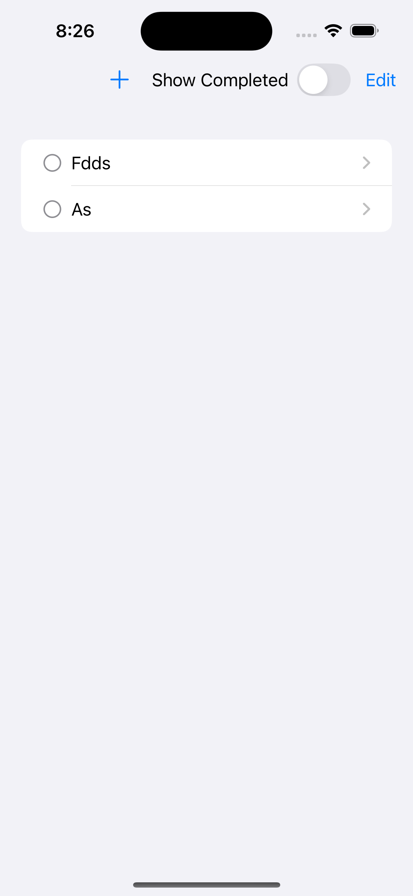
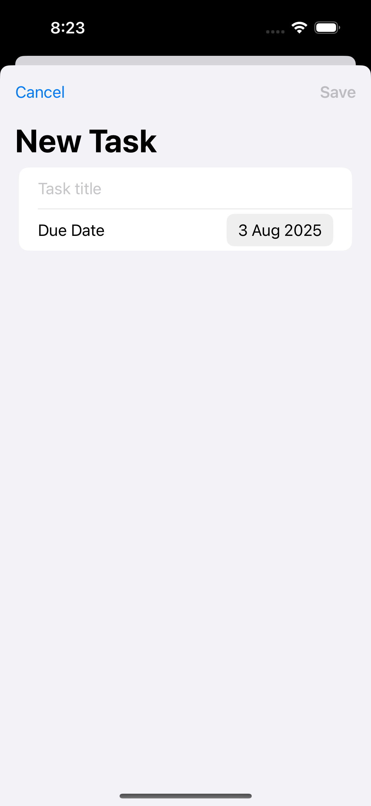
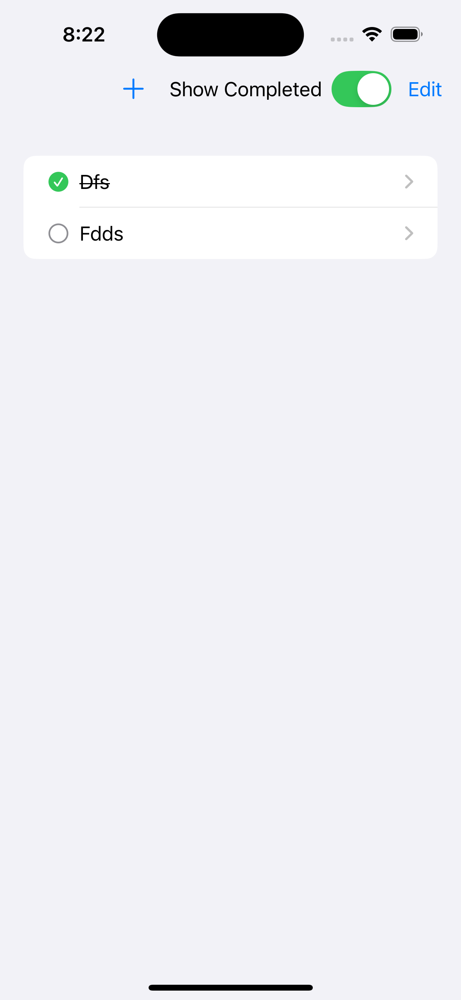

# GGToDo

A clean, modern **To‑Do app** built with **SwiftUI** and **SwiftData**, designed as a portfolio project to demonstrate professional iOS/macOS development practices.

---

## ✨ Features
- **Add, edit, and delete tasks** with a simple, intuitive UI.
- **Mark tasks as complete** with a checkmark toggle.
- **Automatic completion date** when tasks are finished.
- **Show/hide completed tasks** via a toolbar toggle.
- **Due dates** for better task management.
- **Persistent storage** with SwiftData — no account required.
- Adaptive layout for **iPhone, iPad, and macOS**.
- **Light/Dark Mode** support.

---

## 🛠️ Tech Stack
- **SwiftUI** for declarative UI
- **SwiftData** for persistence
- **MVVM architecture** for maintainability
- **NavigationSplitView** for cross‑platform navigation
- **Xcode 15** / **iOS 17+**, **macOS 14+**

---

## 📸 Screenshots
| Task List | Add Task | Completed Task |
|-----------|----------|----------------|
|  |  |  |

---

## 🚀 Getting Started

### Requirements
- Xcode 15 or later
- iOS 17 / macOS 14 or later

### Installation
1. Clone the repository:
   ```bash
   git clone https://github.com/yourusername/GGToDo.git

	2.	Open GGToDo.xcodeproj in Xcode.
	3.	Build and run on your preferred simulator or device.

⸻

📂 Project Structure

## 📂 Project Structure
GGToDo/
├── Models/
│   └── Task.swift
├── Views/
│   ├── ContentView.swift
│   ├── AddTaskView.swift
├── Resources/
│   ├── Assets.xcassets
│   └── .gitignore
├── README.md
└── GGToDoApp.swift

⸻

📅 Roadmap
	•	Edit task titles and due dates
	•	Local notifications for upcoming deadlines
	•	iCloud sync for cross‑device data
	•	Widgets for quick task access

⸻

🧑‍💻 Author

Gerard Grundy
iOS/macOS Developer | Swift Enthusiast
LinkedIn • Portfolio

⸻

📄 License

This project is licensed under the MIT License — see the LICENSE file for details.

---

If you like, I can **add this file directly into your Xcode project** so that when you push with GitHub Desktop, it’s already included.  
Do you want me to insert it now?
